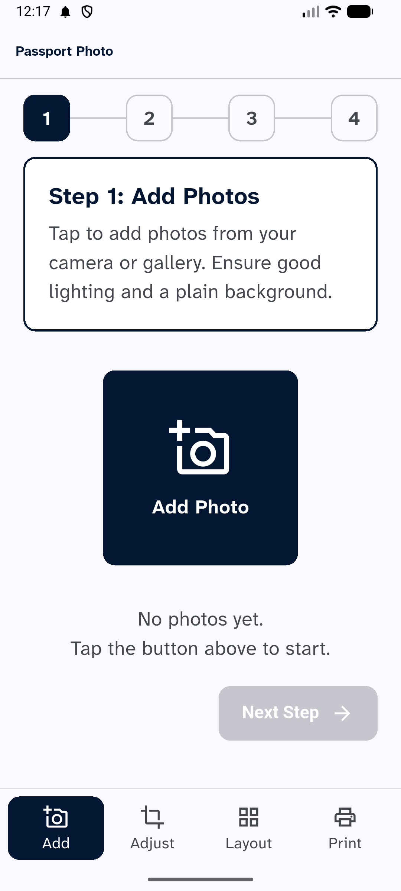
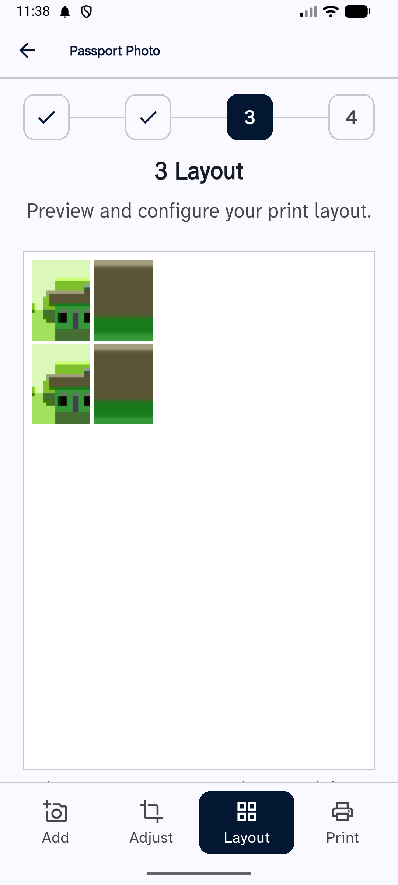
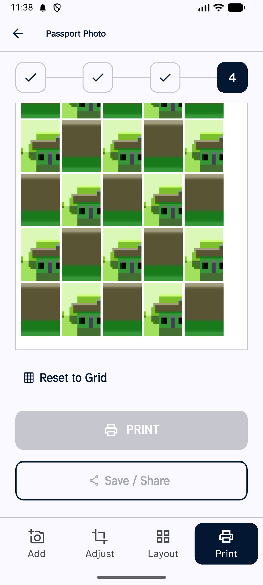
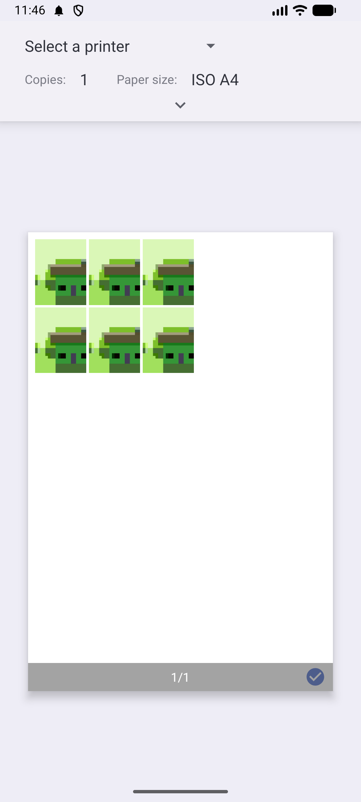

# Passport Photo Studio

Take a photo, crop it to a standard ID or passport size, arrange copies on one
sheet, and print it — or save it as a PDF to print somewhere else.

Built for people who need a document photo printed without fuss: small photo
studios, and anyone who finds most apps hard work. Every screen is meant to be
usable by someone who has never used a smartphone app before.

Everything happens on the device. No account, no upload, no internet needed.

[](LICENSE)
[](https://flutter.dev)
[](#)

---

## Download

Grab the APK from the [**Releases**](../../releases/latest) page and install it
on your Android phone.

| Your phone | File |
| --- | --- |
| Almost every phone made since 2017 | `app-arm64-v8a-release.apk` |
| Older or budget devices | `app-armeabi-v7a-release.apk` |
| Emulators | `app-x86_64-release.apk` |

If you are not sure, take `arm64-v8a`. Android will refuse to install the wrong
one, so nothing breaks if you guess.

You will need to allow installing from outside the Play Store the first time.

---

## What it does

<p align="center">
  
  
  
  
</p>

Four numbered steps, in order.

**1 · Add** — take a photo or pick several from the gallery. More than one
person can share a sheet.

**2 · Adjust** — pinch to zoom and drag to frame the face inside the guide box,
with the dashed eye line to line up against. Rotate a photo that came out
sideways. Each photo keeps its own framing.

**3 · Layout** — choose 4, 6, 8 copies or fill the sheet, on A4, Letter or 4×6in
paper. The preview is the real shape of the paper.

**4 · Print** — drag any photo to move it, with alignment guides that snap like
the ones in Word. Tap a photo to swap who is in that slot. Then print to any
printer your phone already knows about, or save a PDF to print elsewhere.

### Photo sizes

| Size | Where it is used |
| --- | --- |
| 35 × 45 mm | India, UK, EU passports (default) |
| 2 × 2 in | United States passports |
| 35 × 35 mm | ID photos |
| 4 × 6 in | Standard photo print |
| Custom | Anything from 10 to 300 mm |

Photos are laid out with a 2 mm gap so there is room to cut between them.

---

## Why it prints accurately

The whole layout is calculated in **millimetres** — never in pixels, and never
at a screen resolution.

The preview scales those millimetres to the screen. The PDF writes the same
numbers straight into the page. There is no screenshot-and-rescale step in
between, which is where printed output usually drifts away from what was on
screen. Photos are embedded at 300 DPI.

A 35 × 45 mm photo comes out 35 × 45 mm.

---

## Building it yourself

Needs [Flutter](https://docs.flutter.dev/get-started/install) 3.44 or newer.

```bash
git clone https://github.com/ramanyadav9/Passport-Photo-Studio.git
cd Passport-Photo-Studio
flutter pub get
flutter run
```

Release builds, one per CPU architecture:

```bash
flutter build apk --release --split-per-abi
```

Debug keys are used unless you add `android/key.properties` — see
[docs/RELEASING.md](docs/RELEASING.md).

### Layout

```
lib/
  layout/     packing and snapping — pure Dart, no Flutter, unit tested
  models/     photo and paper sizes, crop transform, tiles
  state/      one ChangeNotifier holding the whole session
  screens/    the four steps
  widgets/    crop canvas, sheet preview, draggable sheet
  export/     PDF generation
  services/   photo picker, print and share
```

`lib/layout/` is deliberately free of Flutter imports. Layout is arithmetic, and
arithmetic is easier to trust when it can be reasoned about without a widget
tree in the way.

---

## Built with

Flutter · [`pdf`](https://pub.dev/packages/pdf) and
[`printing`](https://pub.dev/packages/printing) for millimetre-accurate
documents and the native print dialog ·
[`image_picker`](https://pub.dev/packages/image_picker) ·
[`image`](https://pub.dev/packages/image) ·
[`provider`](https://pub.dev/packages/provider)

Typeface: [Atkinson Hyperlegible
Next](https://www.brailleinstitute.org/freefont/), designed by the Braille
Institute to make characters easier to tell apart for low-vision readers. It is
bundled with the app rather than fetched, so it renders the same with no
connection.

---

## Known limits

- **One sheet at a time.** Asking for more copies than fit caps the number
  rather than starting a second page.
- **Nothing is saved.** Closing the app clears the photos. This is deliberate —
  a walk-in customer's face should not still be there for the next one.
- **iOS is untested.** The code and every plugin support it, but it has only
  been built and run on Android.

Contributions welcome — multi-page sheets would be the most useful thing to add
next.

---

## License

[MIT](LICENSE). Use it, change it, sell it, ship it.
